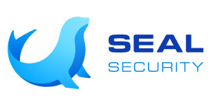

# Seal CLI Action

The CLI action allows users to easily incorporate the [Seal CLI](https://github.com/seal-community/cli) into their GitHub Actions based CI pipeline.
The Seal CLI allows users to easily replace vulnerable packages in their projects with sealed, vulnerability-free versions, which are available for download from Seal's artifact server. To read more see the [documentation](https://docs.sealsecurity.io/fundamentals/cli).

## Usage
Incorporating the CLI action is very simple. Just add the following code immediately after pulling the packages (for example `npm install`) and before any other step.
```yml
  name: seal cli
  uses: seal-community/cli-action@latest
  with:
    mode: fix
    fix_mode: all
    token: <token>
    project: <project-id>
```

## Flags
`fix_mode`: If the `mode` is `fix`, then the `fix_mode` sets how the CLI decides what packages to fix. `local` only fixes packages according to the [local configuration file](https://docs.sealsecurity.io/fundamentals/cli/fixing-specific-packages), whereas `all` fixes everything that has an available sealed version. The default value is `local`.

`mode`: The mode to run the CLI. `scan` to analyze the dependencies and identify vulnerable packages. `fix` to replace vulnerable packages with their sealed versions. The default value is `scan`.

`project`: The project ID, which uniquely identifies the project on the Seal platform. **If the project was already defined in the Seal platform (for example if its source code was scanned by the Seal app), then use the same ID here. Otherwise, the Seal platform will think this is a different project.** If the project does not already have a project ID, then explicitiy set a new one here. The project ID must only include ASCII letters, digits, underscores, hyphens or periods, and mustn't be over 255 characters long. By default the empty string.

`summary`: If the `mode` is `fix`, then the path to a summary file recording what packages were replaced. By default the file is not generated.

`target`: The root directory of the project you wish to fix. By default the current working directory of the GitHub action.

`token`: The authentication token to the Seal artifact server.

`verbosity`: Sets the verbosity level of the CLI: `v`, `vv` or `vvv`. By default `v`.

`version`: The CLI version to use, for example v0.1.0. By default the latest version will be used.

## How to Contribute
We're always looking for feedback, discuss possible integrations and receive feature requests.
Please open issues, pull requests, or contact us at [contribute@seal.security](mailto:contribute@seal.security).

## About Seal Security



Seal Security is an early-stage cybersecurity startup committed to simplifying vulnerability remediation for developers and application security practitioners. For more details, visit our [website](https://seal.security).
